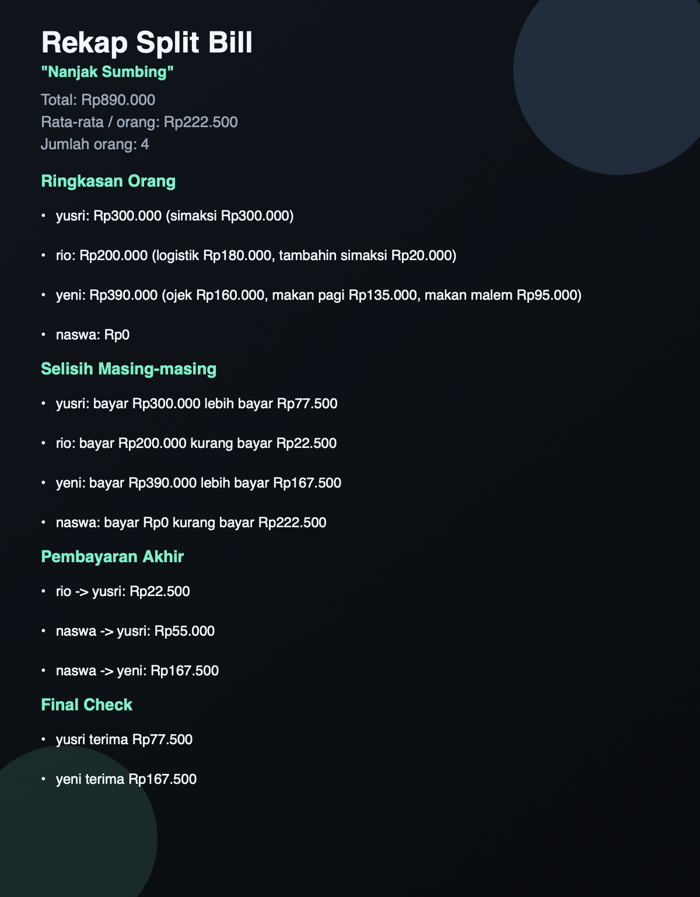

# Hitungin

Web app sederhana untuk bantu hitung split bill trip, jalan-jalan, atau patungan rame-rame dalam satu file HTML.

Repo: [https://github.com/yusriyadi/hitungin.git](https://github.com/yusriyadi/itungin.git)

## Screenshot



## Fitur

- Single file app: cukup buka `index.html`
- Tambah nama orang satu per satu
- Input pengeluaran per orang
- Support format angka seperti `100000`, `1.000.000`, `20k`, `135rb`, `1.5jt`
- Import data dari format chat
- Hitung total, rata-rata per orang, selisih bayar, dan pembayaran akhir
- Tambah judul trip opsional
- Share rekap dalam bentuk teks
- Copy rekap ke clipboard
- Share gambar PNG
- Download gambar PNG

## Cara Pakai

1. Buka [index.html](/Users/yusriyadi/Developer/web/split-bill/index.html) di browser.
2. Isi `Judul trip opsional` kalau mau.
3. Tambahkan orang secara manual, atau pakai `Import Format Chat`.
4. Isi pengeluaran masing-masing orang.
5. Lihat hasil di bagian:
   - `Ringkasan Orang`
   - `Selisih Masing-masing`
   - `Pembayaran Akhir`
   - `Final Check`
6. Gunakan section `Rekapan` untuk share atau download hasil.

## Format Chat

Contoh input:

```text
yusri : simaksi 300000
rio : logistik 180k, tambahin simaksi 20k
yeni : ojek 160, makan pagi 135k, makan malem 95k
naswa : -
```

Catatan:

- Satu baris untuk satu orang
- `-` berarti tidak ada pengeluaran
- Angka seperti `160` akan dibaca sebagai `160k`

## Hasil Perhitungan

App ini akan menghitung:

- total seluruh pengeluaran
- rata-rata per orang
- siapa yang lebih bayar
- siapa yang kurang bayar
- transfer paling efisien supaya balance

## Tech

- HTML
- CSS
- Vanilla JavaScript

Tanpa framework dan tanpa backend.
